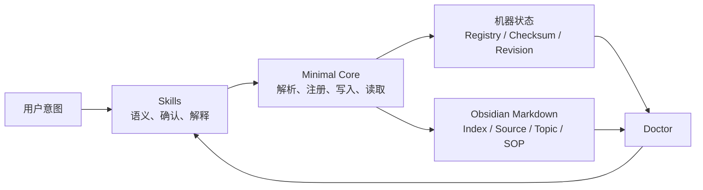

# Obsidian LLM Wiki v0.2 可靠性设计

## 状态

本文定义 `obsidian-llm-wiki` v0.2 的推荐设计基线，并明确哪些能力延后到 v0.3。当前实现基线为 main 分支 `032608c`，其中已有 `scripts/obsidian_wiki_doctor.py`、Doctor Skill 和单元测试。

v0.2 定位为最小可用可靠性版本：保留现有五个 Skill 的意图边界，引入一个最小确定性 Core，并打通“Root 解析 -> 单个来源摄入 -> 受控页面写入 -> 索引重建 -> Doctor 校验”的首个垂直切片。Context Pack、完整知识可用性评分和自动迁移延后到 v0.3。

## 背景

项目已经形成清晰的五段式工作流：

```text
init -> ingest -> doctor -> maintain -> query
```

现有设计的优势包括：

- 不移动或删除用户原始笔记。
- 外部资料默认采用路径索引，不默认复制进 Vault。
- Doctor 只读诊断，Maintain 执行用户确认过的修复。
- Query 优先读取 Wiki 页面，并说明证据缺口。
- Topic、Source、Project、Entity 和 SOP 等页面可供人和 Agent 共同使用。

当前主要风险不是 Skill 数量不足，而是结构操作仍主要依赖 Agent 临场执行：

- Vault 和 control center 解析规则存在重复与个人机器路径假设。
- 同一来源状态可能同时出现在 `ingest/index.md`、source proxy、`wiki/index.md`、主题页和 `log.md` 中。
- Init 创建完整目录，不代表知识内容已经足够支持 Query。
- 同一资料重复摄入、原文件变化或用户修改生成页时，缺少稳定冲突协议。
- Doctor 之外的流程缺少确定性执行面和端到端回归安全网。

## 设计目标

### v0.2 硬目标

v0.2 完成后，一个新用户应该能够：

1. 安装项目后明确绑定一个 Obsidian Vault。
2. 重复运行 Init 而不破坏已有内容。
3. 在 Ingest 前看到计划，并在确认后才发生深度读取或写入。
4. 重复摄入同一来源时更新原记录，而不是生成重复页面。
5. 在来源变化或用户修改生成页时得到明确冲突报告。
6. 从 registry 确定性重建 `ingest/index.md` 和 `wiki/index.md`。
7. 继续使用现有 Doctor 命令，同时由新的 Root Resolver 提供唯一解析逻辑。
8. Doctor 至少保证“只有 `index.md` 和 `log.md` 的空壳 Wiki 不得判定为 Query Ready”。
9. 在写入中断、锁冲突或部分失败后保持可诊断状态。
10. 在 Windows 和 Ubuntu 上使用同一套路径与状态协议。

### v0.3 后续目标

- Query 使用确定性 Context Pack，并报告引用、新鲜度和证据缺口。
- Doctor 区分“结构存在”“来源可追溯”和“知识可查询”。
- 提供 v0.1 Vault 的自动迁移预览与执行工具。
- 增加目录型来源、完整跨平台矩阵和批量摄入。

## 非目标

v0.2 不包含：

- Obsidian 插件或图形界面。
- Embedding、向量数据库或语义检索服务。
- 多人实时协作、云同步或权限系统。
- 自动移动、重命名或批量改写用户原始笔记。
- 面向所有业务领域的完整通用 `llm-wiki-runtime`。
- 自动生成未经来源支持的主题关系、项目结论或知识事实。
- 确定性 Context Pack、除空壳保护之外的完整知识可用性评分和自动迁移执行；这些属于 v0.3。

## 路线选择

### 路线 A：继续加固文档型 Skill

只补充 Skill 规则、模板、README 和提示词测试。改动小，但不能从机制上解决状态漂移、重复写入和冲突恢复。

### 路线 B：引入最小确定性 Core

Skill 负责语义判断和用户确认，标准库 CLI 负责路径解析、状态注册、原子写入、Context Pack 和确定性校验。

这条路线能直接解决当前可靠性问题，同时保持项目轻量、Markdown-first 和 Agent Runtime 可移植性。

### 路线 C：直接建设完整 Runtime 或 Obsidian 插件

长期产品能力最强，但当前范围过大，容易在核心数据契约尚未稳定时引入安装、UI、兼容和发布负担。

### 决策

v0.2 采用路线 B。

项目继续保持“不是 Obsidian 插件”的定位。Minimal Core 是五个 Skill 的确定性执行面，不是新的业务工作流，也不解释知识语义。

## 总体架构



系统分为四层：

1. **Skill 层**：识别意图、解释内容、请求确认、生成语义内容。
2. **Minimal Core 层**：执行确定性的文件系统和状态操作。
3. **Markdown Wiki 层**：提供 Obsidian 可见、可链接、可人工补充的知识页面。
4. **Doctor 层**：检查机器状态与 Markdown 投影，输出 findings 和方向性评分。

## Skill 边界

### `obsidian-wiki-init`

负责确认目标 Vault、盘点目录和文件类型、生成知识库地图和建设路线图。它不得猜测个人默认路径、覆盖现有索引或直接维护 registry 格式。

### `obsidian-wiki-ingest`

负责理解来源主题、价值和风险，生成 Ingest Plan，请求确认，并生成 source、topic、project、entity 或 SOP 页面正文。它不得自行决定 source ID，也不得在 checksum 冲突时强制覆盖。

### `obsidian-wiki-doctor`

负责运行并解释 `validate`、`score` 和 `report`，区分确定性发现与方向性成熟度判断，并生成窄范围 Repair Plan。它始终只读。

### `obsidian-wiki-maintain`

负责消费 Doctor finding 或用户指定的修复范围，重述将修改的文件和动作，并调用 Core 执行已确认修复。它不得未确认批量修复或猜测新的知识关系。

### `obsidian-wiki-query`

负责根据问题缩小读取范围，加载 Context Pack，区分来源事实、Wiki 摘要和 Agent 推断，并说明引用、新鲜度和证据缺口。它默认只读。

## Minimal Core

Minimal Core 使用 Python 标准库实现，最低支持 Python 3.10。现有代码已使用 `X | None` 类型语法，因此 v0.2 不承诺兼容 Python 3.9 及更早版本。

建议结构为：

```text
scripts/llm_wiki.py
scripts/llm_wiki_core/
  root.py
  state.py
  writer.py
  doctor.py
scripts/obsidian_wiki_doctor.py
```

`scripts/llm_wiki.py` 是新的权威 CLI。`scripts/obsidian_wiki_doctor.py` 在 v0.2 和 v0.3 中保留为薄兼容包装，只负责参数映射并调用 `llm_wiki_core.doctor`；弃用提示写入 stderr，避免污染 JSON stdout。计划在 v0.4 移除旧入口。

公开命令使用 JSON 标准输出和稳定退出码：

```text
0  成功
1  可预期降级，例如未配置或未启用
2  校验错误，例如不安全路径、冲突或无效状态
3  IO、锁或原子写失败
4  未预期内部错误
```

v0.2 命令范围按职责分组：

```text
root resolve
state init
ingest apply
page apply
projection rebuild
doctor validate
doctor score
doctor report
```

`source register`、`page write` 和单个投影更新是 Core 内部操作，不作为 Skill 跨进程串行调用的公开命令。公开的 `ingest apply` 在同一个锁和同一个 operation 下完成来源登记、页面写入、registry 更新和投影重建；`page apply` 为 Init 或 Maintain 提供不包含新 source 的页面级事务。

v0.3 再增加 `inventory`、`query context-pack` 和 `migrate`。v0.2 的 Ingest 仍可使用 Agent 的只读文件扫描，但所有持久化必须通过 `state init`、`ingest apply`、`page apply` 或 `projection rebuild` 等事务级 Core 命令。

Core 只负责确定性能力：

- Vault、control center 和 wiki root 解析。
- 路径边界检查。
- 稳定 ID、source registry 和 page registry。
- 原子写入、锁、checksum 和 revision log。
- Index 投影。
- Doctor 确定性检查和结构化输出。

Core 不负责总结文档、判断主题或回答知识问题。

## Root 解析协议

必须移除所有个人机器默认路径。解析顺序固定为：

1. 用户明确提供的 Vault、control center 或 wiki 路径。
2. 从当前工作目录向上查找 `.obsidian-llm-wiki.json`。
3. 环境变量 `OBSIDIAN_LLM_WIKI_ROOT`。
4. 用户级配置中唯一一个被用户明确标记为 active 的 Vault。
5. 返回 `missing_config`。

约束：

- 不对整个磁盘执行递归搜索。
- 没有 active Vault 或发现多个候选时返回候选列表，由用户选择。
- 写入前输出解析后的 `vault_root`、`control_center` 和 `wiki_root`。
- 来源目录与目标 Wiki 分别解析；来源路径不得自动成为 Wiki root。
- 最终写入路径 normalize 后必须仍位于目标 control center 内。

用户级配置只保存用户确认过的 Vault 路径，不保存知识内容。建议位置：

```text
Windows: %APPDATA%/obsidian-llm-wiki/config.json
macOS:   ~/Library/Application Support/obsidian-llm-wiki/config.json
Linux:   ~/.config/obsidian-llm-wiki/config.json
```

项目级配置采用 JSON 而不是 YAML，避免“标准库实现”依赖额外 YAML 解析器。示例：

```json
{
  "schema_version": 1,
  "vault_root": "D:/notes/My Vault",
  "control_center": "00-知识库中控",
  "active": true
}
```

## 目录和状态模型

v0.2 在 control center 内保存少量机器状态，同时保持所有知识内容 Markdown-first：

```text
00-知识库中控/
  .meta/
    schema.json
    sources.json
    pages.json
    operations.json
    change-log.jsonl
    lock.json

  ingest/
    index.md

  raw/

  wiki/
    index.md
    log.md
    AGENTS.md
    sources/
    topics/
    projects/
    entities/
    sops/
```

### 单一事实源

| 信息 | 权威来源 |
|---|---|
| 原始知识事实 | 用户原始笔记和外部资料 |
| 来源身份、路径、checksum、模式和状态 | `.meta/sources.json` |
| 页面身份、类型、来源关系和托管区 checksum | `.meta/pages.json` |
| Wiki 导航 | `wiki/index.md`，由 Core 投影生成 |
| 摄入批次展示 | `ingest/index.md`，由 Core 投影生成 |
| 操作审计 | `.meta/change-log.jsonl` |
| 当前健康状态 | Doctor 即时检查结果 |

`sources.json` 和 `pages.json` 是按 ID 建索引的当前状态快照，每次更新在锁内执行整文件原子重写。`change-log.jsonl` 是唯一 append-only 审计源，不承担当前状态查询。

`wiki/index.md`、`ingest/index.md` 和 `wiki/log.md` 都是人类可读投影，不是独立状态源。报告和评分也不得反向改写 registry 或 change log。

页面 frontmatter 是 page registry 的人类可见镜像，不是第二事实源。Doctor 负责检查 frontmatter 与 registry 的漂移。

### 托管投影区

为兼容 v0.1 内容和用户手工导航，`projection rebuild` 不重写整个 Markdown 文件，只替换托管区：

```markdown
用户手写或 v0.1 保留内容

<!-- llm-wiki:projection:start -->
由 registry 或 change log 生成的内容
<!-- llm-wiki:projection:end -->
```

投影规则：

- `wiki/index.md` 和 `ingest/index.md` 的托管区由 source/page registry 生成。
- `wiki/log.md` 的托管区由 `change-log.jsonl` 生成，Core 不直接向 `wiki/log.md` 追加独立审计事实。
- 托管区之外的内容原样保留，不参与 registry 一致性判断。
- 缺失托管 marker 时，Core 只在用户确认接管后创建；marker 重复、嵌套或顺序错误时返回 `projection_conflict`。
- “确定性重建”仅指托管区；整个文件仍允许包含旧版内容和用户内容。

### Source Registry

每条来源记录至少包含：

```json
{
  "source_id": "src-example-001",
  "display_path": "D:\\materials\\example.md",
  "canonical_path": "D:/materials/example.md",
  "source_type": "markdown",
  "mode": "path-index",
  "status": "processed",
  "fingerprint": {
    "size": 1024,
    "mtime_ns": 1783658400000000000
  },
  "checksum": "sha256:...",
  "proxy_page_id": "page-source-example-001",
  "sensitivity": "normal",
  "last_verified_at": "2026-07-10T10:00:00+08:00"
}
```

`sources.json` 的顶层结构包含 `schema_version` 和以 `source_id` 为键的 `records` 对象；`pages.json` 使用相同模式并以 `page_id` 为键。更新时读取完整快照、校验唯一键、写入临时文件并原子替换，不使用“同一 ID 最后一行生效”的隐式规则。

`change-log.jsonl` 每行记录递增 sequence、operation、record ID、旧/新 checksum、时间和结果。它只追加审计事件；当前状态始终读取 snapshot registry。

规则：

- `source_id` 创建后保持稳定。
- 路径是来源属性，不是来源身份。
- 同一路径 checksum 变化时更新 revision，不创建新 source。
- 新路径与已有来源 checksum 相同时登记为移动候选，由用户确认是否重新绑定原 source ID。
- 无法确认是否为同一来源时产生 candidate conflict，不自动合并。
- 敏感来源可以只保存路径、类型、风险和建议，不保存摘要原文。

### Ingest 事务与状态机

Skill 在事务开始前完成来源读取、语义分析和页面内容生成，然后把一个完整、已确认的 operation payload 交给 `ingest apply`。Core 不在持锁期间等待模型生成内容或用户确认。

`ingest apply` 在同一进程、同一把 Vault 锁下完成：

```text
校验 operation payload 与目标 Vault
-> 创建 operation_id，状态 running
-> 写入 source 状态 pending
-> 原子写 source proxy 托管区
-> 原子更新 page registry
-> projection rebuild
-> 写入 source 状态 processed
-> 追加一条 completed change-log event
-> 标记 operation completed
-> 释放锁
```

`operations.json` 保存尚未归档的 operation 当前状态，至少包含 `operation_id`、`idempotency_key`、source/page IDs、current_step、status、started_at、updated_at 和 error。`idempotency_key` 由目标 Wiki ID、source ID、来源 checksum 和计划写入的托管内容 checksum 确定性生成。完成操作可以在 change log 落盘后从 `operations.json` 清理；`running` 或 `failed` 操作用于 Doctor 诊断和 Maintain 恢复。

状态规则：

- `source register` 只能先写 `pending`，不得直接写 `processed`。
- 只有页面、page registry 和托管投影均成功后，source 才能进入 `processed`。
- 任一步失败时，operation 标记为 `failed`，source 保持 `pending` 或标记 `failed`，不得显示为完成。
- 已成功原子替换的文件不假装回滚；Doctor 根据 operation 和 registry 报告精确的恢复步骤。
- Maintain 只能在用户确认后执行 `resume` 或 `rollback-metadata`；不得删除用户原始来源或用户正文。
- 相同 idempotency key 的已完成 operation 返回原结果，不重复创建 source proxy。

### 路径规范化与来源指纹

Core 同时保存用户输入的 `display_path` 和用于比较的 `canonical_path`。

`canonical_path` 按以下规则生成：

- 转换为绝对路径并消除 `.`、`..`。
- 内部统一使用正斜杠。
- Windows 比较时使用 case-fold，但保留磁盘原始大小写用于显示。
- 对已存在路径解析 symlink / junction 的真实目标，同时保留 `display_path`。
- 路径解析后仍需执行允许范围检查，禁止借助 symlink 越界写入。

普通文件先比较 `size + mtime_ns` 快速 fingerprint。fingerprint 未变化时可以复用已有 checksum；fingerprint 变化、首次摄入或用户显式要求完整验证时计算 SHA-256。仅凭 fingerprint 不得把两个来源判定为同一来源。

v0.2 只对用户确认的单个文件计算内容 checksum。目录型来源在 v0.2 只保存排序后的文件清单和每项 fingerprint；基于逐文件内容 checksum 的目录聚合摘要延后到 v0.3。

### 页面契约

每个由 Agent 管理的页面包含稳定 frontmatter：

```yaml
---
tags:
  - user-managed-tag
# llm-wiki:frontmatter:start
llm_wiki_schema: 1
llm_wiki_page_id: "page-source-example-001"
llm_wiki_page_type: "source"
llm_wiki_source_ids: ["src-example-001"]
llm_wiki_generated_by: "obsidian-wiki-ingest"
llm_wiki_generated_at: "2026-07-10T10:00:00+08:00"
llm_wiki_managed_checksum: "sha256:..."
# llm-wiki:frontmatter:end
aliases:
  - 用户维护别名
---
```

Core 不解析或重写完整 YAML frontmatter，只按 marker 定位并维护 `llm_wiki_*` 平坦字段。每个托管字段独占一行，冒号后的值必须是可由 Python 标准库 `json.loads` 解析的 JSON scalar 或 array；不支持托管字段的多行 YAML、anchor、alias 或嵌套 mapping。`tags`、`aliases`、`cssclasses` 及其他未知字段属于用户区域。

页面分成托管区和用户区：

```markdown
<!-- llm-wiki:managed:start -->
由 Agent 和 Core 管理的结构化内容
<!-- llm-wiki:managed:end -->

## 用户补充

用户可自由编辑的内容
```

更新规则：

- Core 只更新托管区。
- 用户区始终保留。
- `llm_wiki_managed_checksum` 只覆盖 `llm_wiki_*` 托管字段和 `llm-wiki:managed` 正文区，不包含用户 frontmatter 或用户补充内容。
- 计算 checksum 时排除 `llm_wiki_managed_checksum` 字段自身，避免自引用。
- 托管区 checksum 与 registry 不一致时返回 conflict。
- Doctor 的 frontmatter 漂移检查只比较 marker 内的 `llm_wiki_*` 字段。
- 托管 marker 必须在 YAML frontmatter 内唯一、成对且顺序正确；缺失、重复、嵌套或越界时返回 `frontmatter_conflict`，不得尝试猜测修复。
- 未带页面契约的已有笔记默认只读，除非用户明确接管。
- 页面删除、移动或重命名不在 v0.2 自动处理范围内。

## 写入一致性

所有修改 control center 的命令必须通过独占创建获取 `.meta/lock.json`。锁至少记录 `lock_id`、PID、host、command、acquired_at 和目标路径。

锁协议：

- 默认最多等待 30 秒，超时返回 `lock_timeout`。
- 默认 stale TTL 为 10 分钟。
- 同 host、超过 TTL 且 PID 已不存在时，Doctor 将其报告为 `stale-lock`。
- PID 仍存在时不自动判 stale，避免 PID 复用或长任务被误清理。
- 跨 host 的锁永不自动清除，只报告锁信息。
- Doctor 始终只读，不清锁。
- Maintain 在用户确认后把 stale lock 重命名为 `.meta/lock.stale.<timestamp>.<lock_id>.json`，随后才能重新获取锁。
- 正常完成、已处理异常或当前进程主动取消时，由锁持有者释放自己的锁。

Registry、页面和索引投影使用以下原子写流程：

```text
读取当前 checksum
-> 获取锁
-> 再次确认 checksum
-> 在同目录写临时文件
-> flush/fsync（平台允许时）
-> 原子 replace
-> 追加 change log
-> 释放锁
```

如果任何一步失败：

- 不更新 registry 的完成状态。
- 保留原文件。
- 返回明确错误和恢复建议。
- Doctor 能识别遗留临时文件或状态不一致。

幂等性要求：

- `init` 重复执行只补缺失结构。
- `source register` 通过稳定 ID、canonical path 和 checksum 判断已有来源。
- `page write` 在内容未变化时返回 `unchanged`。
- `projection rebuild` 从权威状态重建相同托管区结果。
- Doctor 和 Query 默认只读。

## 核心数据流

### 初始化

```text
确认 Vault
-> root resolve
-> state init 机器状态和缺失目录
-> Agent 只读盘点目录与文件类型（v0.3 起由 inventory 命令替代）
-> Skill 生成知识库地图和路线图
-> page apply
-> doctor validate/report
```

### 摄入

```text
解析来源路径与目标 Wiki
-> Agent 只读盘点候选文件（v0.3 起由 inventory 命令替代）
-> Skill 分类主题、价值和风险
-> 输出 Ingest Plan
-> 用户确认
-> 读取确认过的来源
-> Skill 生成页面语义内容
-> ingest apply
-> doctor validate
```

### 查询（v0.3）

```text
解析目标 Wiki
-> 根据问题生成过滤条件
-> query context-pack
-> Skill 解释页面和来源
-> 输出答案、引用、新鲜度和证据缺口
-> 用户明确要求时才进入保存流程
```

### 修复

```text
Doctor finding
-> Skill 生成窄范围 Repair Plan
-> 用户确认文件与动作
-> Maintain 调用 page apply 或 projection rebuild
-> 重新 doctor validate
```

## Context Pack（v0.3）

Context Pack 不属于 v0.2 硬验收。v0.3 的 `query context-pack` 必须是确定性的，并只允许缩小读取范围。支持：

```text
--page-id
--page-type
--source-id
--path
--glob
--topic
--max-files
--max-chars-per-file
```

默认行为：

1. 应用显式过滤条件。
2. 排除 `.meta/`、`raw/` 和未确认的敏感来源正文。
3. 按路径稳定排序。
4. 应用文件数和字符数限制。
5. 返回页面路径、标题、片段、source IDs、checksum 和 freshness。

Query 必须区分原始来源事实、Wiki 摘要、Agent 推断以及缺失、冲突或过期的上下文。

## Doctor 演进与兼容

v0.2 不重写现有 742 行 Doctor 的检查语义，而是把其实现迁移到共享 `llm_wiki_core.doctor`，由新旧两个 CLI 入口调用，并让 Doctor 使用唯一 Root Resolver。Doctor 始终保持只读：

```text
validate  确定性发现，可用于 CI 或本地门禁
score     方向性成熟度，不阻断工作
report    中文综合诊断和行动建议
```

### 结构健康

- 无效 root。
- 缺失 schema、registry、index、log 或 AGENTS。
- Broken Markdown links 和 Wikilinks。
- 重复 page ID 或 source ID。
- 不安全的绝对路径泄漏。

### 一致性健康

- Registry 指向不存在的 source proxy。
- 页面 frontmatter 与 registry 不一致。
- Index 投影缺失、重复或包含陈旧页面。
- 原始来源 checksum 已变化。
- 遗留锁、临时文件或未完成写入。

### 知识可用性（v0.3）

v0.2 只增加一个窄回归保护：仅存在 `index.md` 和 `log.md`，且没有有效 source proxy 或其他非模板知识页时，不得输出 Query Ready。下面其余成熟度信号随 v0.3 交付：

- 只有模板或空壳页面。
- 有效 source proxy 数量。
- 从 `wiki/index.md` 可达的页面比例。
- 孤儿页面比例。
- Source、Topic、Project、Entity、SOP 的关系覆盖。
- Query 所需来源是否可定位和引用。
- 来源新鲜度和证据缺口。

评分原则：

- 只使用可验证信号。
- 不奖励页面数量或文字长度本身。
- 未启用能力标记为 `not-applicable`，不强制扣分。
- 简单 Wiki 不因缺少 Project 或 Entity 页面被误判。
- `report` 和 `score` 始终是咨询性命令。
- 自动化阻断只使用 `validate --fail-on error`。

## 安全模型

- 不删除、移动或重命名用户原始文件。
- 外部来源默认 path-index。
- 复制进 `raw/` 必须由用户明确确认。
- PDF、Word、Excel、压缩包和二进制目录深度读取前必须确认。
- 可疑来源只登记路径、类型、风险和建议。
- 生成页面不得保存密钥、Token、Cookie、私钥、连接串、内网端点、客户数据或生产日志原值。
- Finding 隐藏敏感原值和不必要的本机路径。
- 用户级配置中的 Vault 路径不进入公开 Wiki 页面。

`privacy` 字段只用于风险提示和 Git 建议，不代表加密或权限控制。

## 错误与降级

| 状态 | 行为 |
|---|---|
| `missing_config` | 不写入，提示用户绑定 Vault |
| `multiple_roots` | 返回候选，不自动选择 |
| `invalid_root` | 安全失败，不扩大搜索范围 |
| `source_conflict` | 不自动合并，返回候选和证据 |
| `page_conflict` | 不覆盖用户修改，生成冲突报告 |
| `lock_timeout` | 不写入，返回锁信息和恢复建议 |
| `stale_lock` | 只报告锁详情，由 Maintain 在用户确认后处理 |
| `unsafe_path` | 拒绝越出 control center 的写入 |
| `sensitive_source` | 降级为 path-index 或请求确认 |
| `runtime_unavailable` | Skill 可给只读建议，但不得声称已写入 Wiki |

任何降级都必须说明未执行步骤、未修改文件、临时文件状态和下一步操作。

## 测试策略

### 单元测试

覆盖 Root 解析、路径规范化与 case-fold 比较、symlink 越界拒绝、稳定 ID、fingerprint 快速路径与 checksum、snapshot registry 原子重写与唯一键校验、operation 状态机与 idempotency key、change log sequence、frontmatter JSON 值解析、marker 冲突、页面与投影托管区更新、用户区与用户 frontmatter 保留、锁获取与 stale 判定、原子替换和 Doctor 脱敏。

### Fixture 端到端测试

v0.2 至少包含：

1. 全新 Vault。
2. 已有大量笔记但未初始化的 Vault。
3. 只有空壳 `index.md` 和 `log.md` 的 Wiki。
4. 一个外部 Markdown 正常摄入。
5. 同一文件重复摄入。
6. 原文件 fingerprint 与 checksum 变化。
7. 用户修改 source proxy 托管区。
8. 用户只修改页面用户区和用户 frontmatter 字段。
9. Broken link、孤儿页和陈旧索引。
10. 敏感内容和疑似敏感文件名。
11. 多个 Vault 候选。
12. 锁冲突、stale lock 和模拟写入中断。
13. `source register` 成功后页面写入失败，source 不能变为 `processed`。
14. 相同 idempotency key 重试不产生重复页面或重复完成事件。
15. v0.1 索引内容在托管投影重建后保持不变。

Context Pack 与迁移相关 fixture 随 v0.3 交付。

### Skill 行为评估

- Query 不进入写入流程。
- Doctor 不自动修复、不清锁。
- Maintain 只处理用户确认的 finding。
- Ingest 未确认时不深度读取或批量生成。
- 工作区与 Vault 不同时，写入已解析的 Vault。
- v0.2 窄规则：只有 `index.md` 和 `log.md` 的空壳 Wiki 不得获得“Query Ready”结论。
- Runtime 不可用时不得声称摄入完成。

### CI

- Ubuntu：单元测试和端到端 fixture。
- Windows：路径规范化、case-fold、锁、原子替换和编码测试。
- Skill package discovery。
- Doctor 对 sample vault 的 `validate --fail-on error`。
- 旧入口 `obsidian_wiki_doctor.py` 与新 CLI 输出等价性测试。

## 迁移与兼容

v0.2 不提供自动迁移工具，但必须与现有 v0.1 Vault 安全共存：

- 未带 frontmatter 的原始用户笔记不修改。
- 无 `.meta/` 的旧 control center 被 Doctor 识别为 legacy 状态，只报告，不自动升级。
- 已有生成页面只有在用户确认接管后才写入 marker frontmatter。
- `obsidian_wiki_doctor.py` 旧入口在 v0.2 和 v0.3 保持可用。

自动迁移（只读扫描 -> 迁移预览 -> 用户确认 -> 创建 `.meta` -> 分配稳定 ID -> 重建投影 -> validate）作为 `migrate` 命令在 v0.3 交付。迁移失败时不修改旧页面，并清理或标记未完成的新状态。

## 分阶段交付

### Phase 1：Root 与配置

移除个人默认路径，实现 `root resolve`，定义项目级与用户级 JSON 配置、路径规范化和跨平台路径测试。

### Phase 2：状态契约与安全写入

增加 `.meta`、schema、snapshot registry、operations journal、锁与 stale 协议、原子写、fingerprint/checksum、change log、frontmatter/正文/投影 marker 和托管区。

### Phase 3：Ingest 接入与索引投影

让 Ingest 生成完整 operation payload 并调用 `ingest apply`，由同一事务完成 source/page registry、source proxy、change log 和托管投影；Agent 只读盘点候选文件。

### Phase 4：Doctor 迁移与一致性检查

把现有 Doctor 实现迁入 `llm_wiki_core.doctor`，旧入口改薄包装，接入唯一 Root Resolver，增加一致性健康检查（frontmatter 漂移、投影漂移、stale source、遗留锁与临时文件）。

### Phase 5：Fixture、CI 与发布

建立 sample vault、端到端测试、Windows/Ubuntu CI、Quick Start 和版本说明。

各 Phase 可独立评审与合并；Phase 1–2 为 v0.2 发布的硬前置，Phase 3–5 完成后打 v0.2 tag。

## 验收标准

1. 仓库中不存在个人机器默认 Vault 路径。
2. 所有写入前都能明确解析并报告目标 Vault，且全项目只有一个 Root Resolver 实现。
3. Init 重复执行不会覆盖现有用户内容。
4. 同一来源重复摄入不会创建重复 source proxy。
5. Index、ingest 和 log 的托管区可以从 snapshot registry 与 change log 确定性重建，托管区外的旧版或用户内容保持不变。
6. Agent 只更新页面托管区和 `llm_wiki_*` 字段，用户区与用户 frontmatter 保持不变。
7. checksum 冲突时停止覆盖并输出修复建议。
8. `ingest apply` 在一个 operation 和一把锁内执行；写入失败时 source 不得进入 `processed`，相同 idempotency key 不得重复应用。
9. stale lock 可被 Doctor 识别、被 Maintain 在确认后处理，跨 host 锁永不自动清除。
10. Doctor 能识别投影漂移、frontmatter 漂移、遗留锁和陈旧来源。
11. 只有 `index.md` 和 `log.md` 的空壳 Wiki 不得被判定为 Query Ready。
12. Doctor 的咨询评分不会阻断正常工作，自动化阻断只使用 `validate --fail-on error`。
13. 旧 `obsidian_wiki_doctor.py` 入口输出与新 CLI 等价，弃用提示只写 stderr。
14. Fixture 覆盖初始化、摄入、冲突、修复主路径。
15. Windows 与 Ubuntu CI 均通过核心测试。

## 设计结论

`obsidian-llm-wiki` 的下一步不是增加更多工作流名称，而是让现有工作流拥有稳定的数据和执行基础：

```text
Skill 负责语义和确认。
Core 负责确定性接入。
Registry 负责状态事实。
Markdown 负责人类知识表达。
Index 只做单向投影。
Doctor 负责只读诊断。
Maintain 只执行确认修复。
```

v0.2 只交付这条基础的首个垂直切片：Root 解析、状态契约、安全写入、Ingest 接入和 Doctor 迁移。Context Pack、知识可用性评分和自动迁移在数据契约稳定后于 v0.3 交付。这条路线保留了 Obsidian 和 Markdown 的开放性，同时为后续接入通用 `llm-wiki-runtime` 或开发 Obsidian UI 留出稳定接口。
